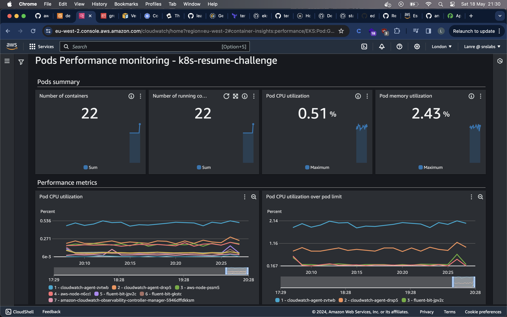
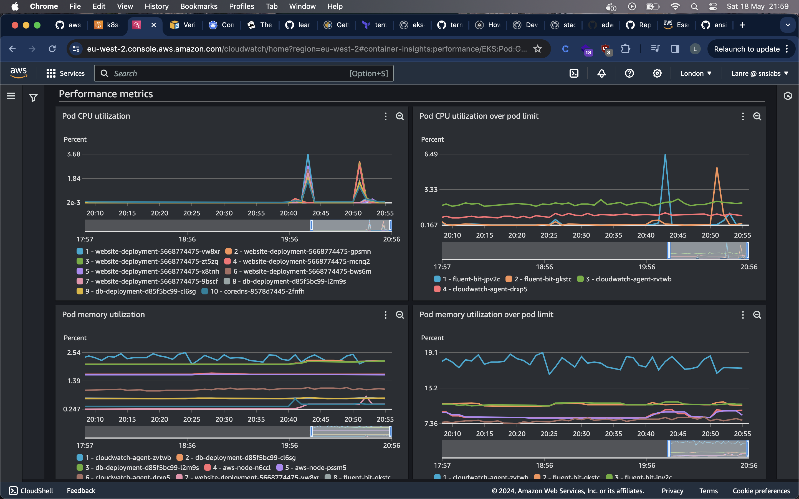

# k8s-challenge

## Intro
Imagine you are going to deploy an e-commerce website. It’s crucial to consider the challenges of modern web application deployment and how containerization and Kubernetes (K8s) offer compelling solutions:

- Scalability: How can your application automatically adjust to fluctuating traffic?
- Consistency: How do you ensure your application runs the same across all environments?
- Availability: How can you update your application with zero downtime?

Containerization, using Docker, encapsulates your application and its environment, ensuring it runs consistently everywhere. Kubernetes, a container orchestration platform, automates deployment, scaling, and management, offering:

- Dynamic Scaling: Adjusts application resources based on demand.
- Self-healing: Restarts failed containers and reschedules them on healthy nodes.
- Seamless Updates & Rollbacks: Enables zero-downtime updates and easy rollbacks.
By leveraging Kubernetes and containerization for your challenge, you embrace a scalable, consistent, and resilient deployment strategy. This not only demonstrates your technical acumen but aligns with modern DevOps practices.

## Challenge Guide
### Prerequisites
Before you embark on this journey, ensure you are equipped with:

- Docker and Kubernetes CLI Tools: Essential for building, pushing Docker images, and managing Kubernetes resources.
- Cloud Provider Account: Access to AWS, Azure, or GCP for creating a Kubernetes cluster.
- GitHub Account: For version control and implementing CI/CD pipelines.
- Kubernetes Crash Course: This free course from KodeKloud contains a number of helpful labs to get you familiar with K8s basics.
- E-commerce Application Source Code and DB Scripts: Available at [kodekloudhub/learning-app-ecommerce](https://github.com/kodekloudhub/learning-app-ecommerce). Familiarize yourself with the application structure and database scripts provided.

## Observability images

