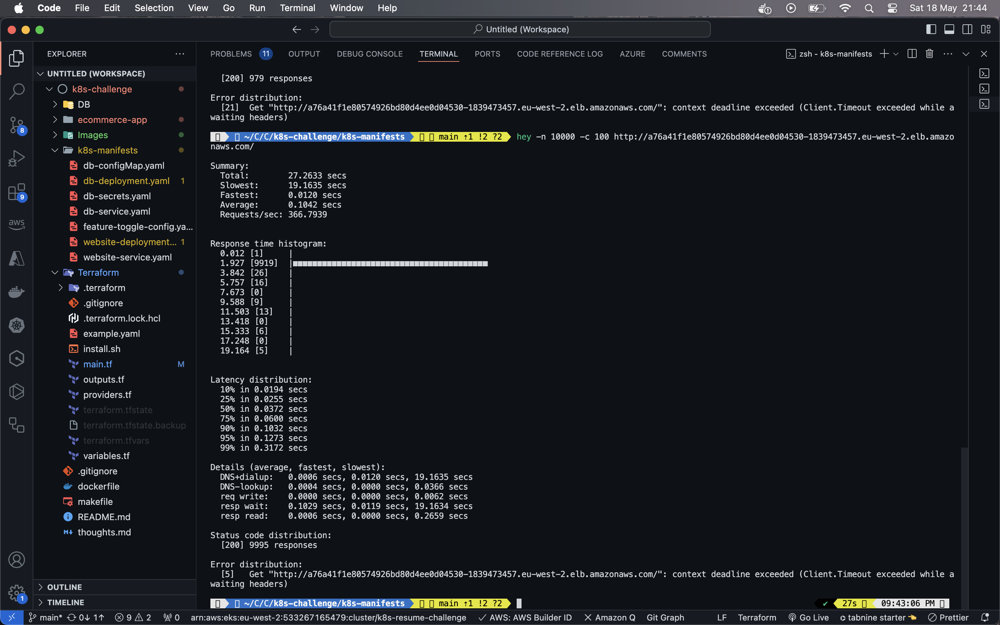
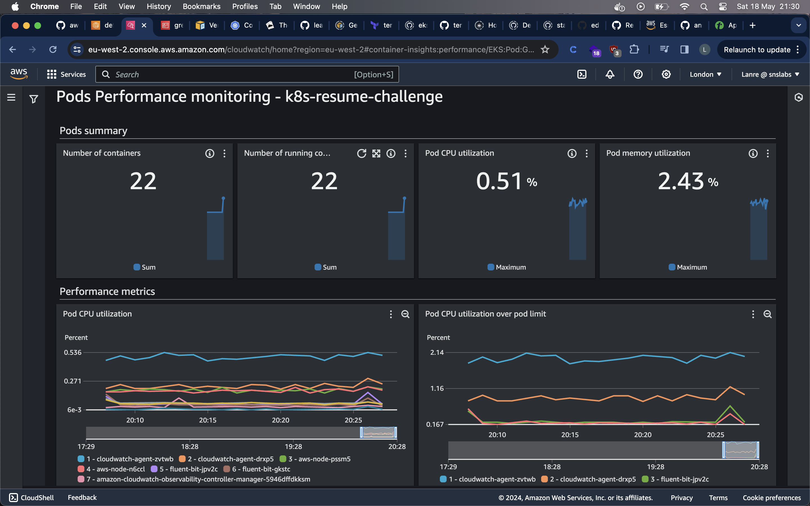
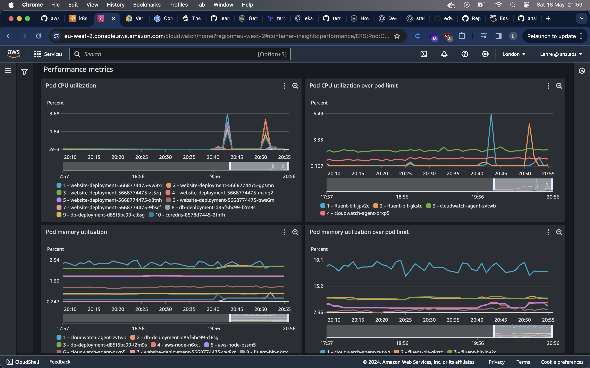
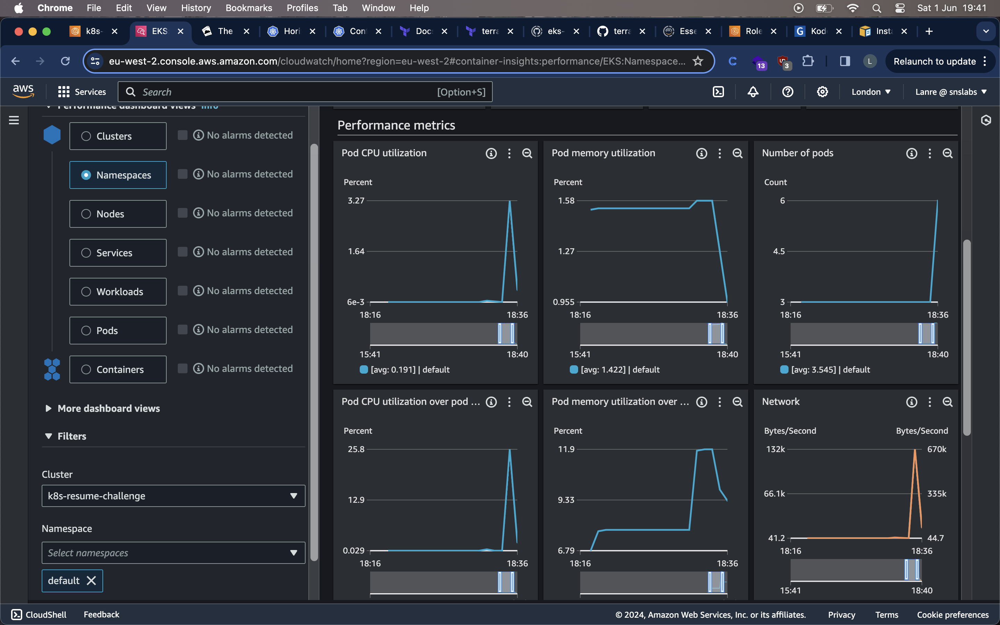
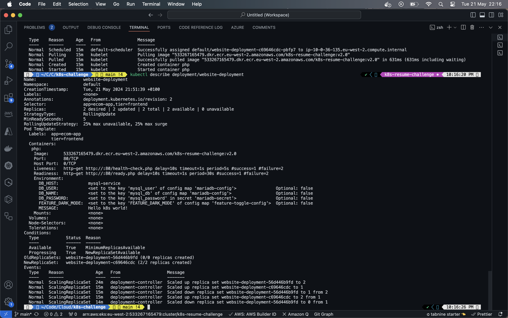

## Thoughts 

- Setting up Docker image for web app was pretty straightforward thanks to previous experience. 

- Choosing AWS EKS was a no-brainer as this is the cloud platform I am most familiar with. Also helped that I had an example EKS config in terraform handy. 

- Seemingly unfixable CrashLoopBackoff error when deploying pods on EKS initially, the docker image was built on arm64 infra on my local machine and the EKS nodes require images built for amd64...took a minute to figure that out.  

## Resources 

- The Kubernetes Book - Nigel Poulton 
- [EKS Reference Architecture - Clowdhaus](https://github.com/clowdhaus/eks-reference-architecture/tree/main)
- [AWS EKS TF module examples](https://github.com/terraform-aws-modules/terraform-aws-eks/tree/master/examples)
- [AWS Observability best practices](https://aws-observability.github.io/observability-best-practices/)
- [EKS Workshop](https://www.eksworkshop.com/docs/fundamentals/)
- [EKS Docs](https://docs.aws.amazon.com/eks/latest/userguide/getting-started.html)
- [EKS add ons](https://docs.aws.amazon.com/eks/latest/userguide/eks-add-ons.html)
- [CrashLoopBackoff Error](https://spacelift.io/blog/crashloopbackoff)
- [Create EKS cluster with Terraform modules](https://antonputra.com/amazon/create-eks-cluster-using-terraform-modules/)

### Step 1 - CKAD Cert

- The CKAD is a work in progress and I prefer getting hands on while studying for cert exams so this works out well for me. 

### Step 2 - Containerize Your E-Commerce Website and Database

- I created the PHP docker image and tested it on my localhost. 

- Created a makefile to automate building and pushing the docker image. I knew I would probably have to do this several times so I decided to create a script to prevent having to do this manually. LAzy? maybe...

### Step 3 - Set Up Kubernetes on AWS (a Public Cloud Provider)

- I've been able to deploy a Terraform EKS config with managed nodes. Potentially trying Fargate/Serverless down the line. I just feel using managed nodes first helps get a better understanding of how everything works. 

### Step 4 - Deploy Your Website to Kubernetes

- Encountered CrashLoopBackOff issue with pods in website-deployment, root cause was the build platform being used on my local to create the PHP docker image. I fixed this by running the docker command with the platform flag like so 

`docker build --platform="linux/amd64" -t $(APP_NAME):$(APP_VERSION) .`

- After a few hours of looking for typos/misconfigurations I was happy/angry this was the issue. 

- All pods running now...

- Deployment: Deployments are a great way to manage stateless apps on Kubernetes. They augment Pods with self-healing, scalability, rolling updates, and rollbacks. Behind-the-scenes, Deployments use ReplicaSets to do most of the work with Pods – it’s actually a ReplicaSet that creates, terminates, and otherwise manages Pods, but the Deployment tells the ReplicaSet what to do.

### Step 5 - Expose Your Website

- Figured out using ConfigMaps and Secrets to pass env variables to both DB and Web app. 

- Created services for both mariadb and web app pretty quickly. Tested the app on my browser and the load balancer URL directs me to the web app. Initially, I thought there were issues but my browser tried to access the URL using HTTPS instead of HTTP, obvs wasn't going to work yet...

- Services: The front-end of a Service provides an immutable IP, DNS name and port that is guaranteed not to change for the entire life of the Service. The back-end of a Service uses labels and selectors to load-balance traffic across a potentially dynamic set of application Pods, a record of healthy pods is kept in the endpoint/endpoint slices object.

### Step 6 - Implement Configuration Management

- Already using ConfigMaps to pass DB creds to web app and mariadb pods. 

- Creating a ConfigMap for the feature-toggle-config was straightforward. 

### Step 7 - Scale Your Application

- Kubectl scale command was easy to understand, can also edit the deployment to increase number of replicas which is more common. 

` kubectl scale deployment/ecom-web --replicas=6 `

- Also did some load testing using the hey cli tool to simulate web traffic to the website then check out the logs and metrics. Back here after realising load testing is required in step 10...never to early to try and break things.

### Step 8 - Perform a Rolling Update

- Updated the index.php to include code for enabling/disabling dark mode so I rebuilt the php container and implemented the rolling update easily.  

- Came across this blog and thought it would be a good idea to try this out. [zero-downtime rolling deployments](https://kunmidevopstories.hashnode.dev/how-to-achieve-real-zero-downtime-in-kubernetes-rolling-deployments-avoiding-broken-client-connections)

### Step 9 - Roll Back a Deployment

- Easy to understand and implement rollbacks. Similar to the rolling update, pods were replaced very quickly and the changes reflected in the browser after a few seconds.

### Step 10 - Autoscale Your Application

- Did step 11 first....will be back 

- Built the horizontal pod autoscaler to scale the deployment as traffic increases on the website-deployment. Also added resource limits to the pods in that deployment.

- EKS does not install metrics-server by default so I had to install this to the kube-system namespace using: 

` kubectl apply -f https://github.com/kubernetes-sigs/metrics-server/releases/latest/download/components.yaml ` 

- To check installation: 

`kubectl get deployment metrics-server -n kube-system `

- Source: [install metrics-server on EKS](https://docs.aws.amazon.com/eks/latest/userguide/metrics-server.html) 

### Step 11 - Implement liveness and readiness probes 

- Read an article about probes and decided to do this before step 10 with my "new found" skills...

- Having a readiness probe set is recommended for applications. Makes sure pods only receive traffic when they are ready to handle requests; the endpoint controller continues to monitor the pods based on the pod’s readiness probe result. When the probe is successful, the endpoints are updated on the service objects to receive traffic.

- Liveness probe is essentially a health check and makes sure the pod/container is running as expected by sending a HTTP request or performing a command on the container and receiving a response. If the pod responds as expected (e.g. with a HTTP status 200) then it passes the health check. Otherwise the pod is terminated and replaced.

- [liveness and readiness probes - K8s docs](https://kubernetes.io/docs/tasks/configure-pod-container/configure-liveness-readiness-startup-probes/)

### Extra 

1. Implement Persistent Storage - PersistentVolumeClaim

2. Implement Basic CI/CD Pipeline - GitHub Actions
